ls# 1.项目介绍


项目地址：[https://www.zdoc.app/zh/topoteretes/cognee](https://www.zdoc.app/zh/topoteretes/cognee)

定位：**开源 AI 记忆平台，用来落地上下文工程范式**；不再手动拼接 prompt 字符串，由平台完成记忆摄入、知识图谱构建、动态检索、上下文组装、会话管理，把上下文工程的理论变成可运行代码。

前置理论回顾：
- 上下文工程核心，系统化管理送入模型上下文窗口全部信息；
- 包含系统指令、检索知识、对话历史、工具结果、示例、输出约束；
- 在有限 Token 预算，最大化信息密度与相关性。
  
Cognee 就是这套思想的开源工程实现。Cognee 是面向 AI 智能体的开源**AI 记忆平台**，Python 为主，同时支持 Rust、TypeScript 客户端。

- 核心能力：摄入多格式原始数据，自动构建**向量 + 知识图谱混合记忆**；
- 支持会话记忆与跨会话持久长期记忆；
- 根据用户查询自动召回高相关记忆片段，组装成高质量上下文交给大模型腾讯云。

Cognee 通过三段式流水线完成知识库构建：Ingestion 接入多源原始数据，Processing 执行分块、向量化、实体关系抽取，生成向量与知识图谱；Enrichment 完成知识推理与迭代优化。底层同时对接向量库、图谱库、关系库等多存储；上层提供 SDK、API、GQL 供业务调用。带*标记的功能属于开发中特性。


和上下文工程理论一一映射：
| 上下文工程理论模块 | Cognee 实现 |
| ---- | ---- |
| 动态上下文组装 | `recall()` 根据 query 自动召回记忆片段，输出可送入 LLM 的上下文文本 |
| Token 预算与信息密度 | 混合检索做相关性过滤，只返回高相关片段，避免把全部文档塞进 prompt，解决 Lost‑in‑the‑Middle 中间遗忘效应 |
| 会话 / 多轮历史管理 | `session_id` 区分会话，短期会话缓存 + 长期图谱持久化，实现对话记忆压缩与存储 |
| 私有知识接入 | RAG 能力，PDF / 文本 / CSV 等多源数据通过 `remember()` 摄入，构建私有知识记忆库 |
| 动态 Few‑shot、示例选择 | 基于语义检索，自动挑选相关历史案例送入上下文 |
| 来源可追溯 | 全部记忆携带文档溯源元数据，方便做输出校验、引用来源 |

>关键认知：Cognee**不是大模型，不是 Agent 框架**；它是独立的**记忆 / 上下文工程中间层**，可以对接 LangGraph、Claude Code、AutoGen 等各类 Agent 框架，专门负责 “怎么把外部资料、会话历史变成高质量模型输入上下文”，正好对应第四章上下文工程>的核心目标。
将用户输入转成图结构

召回过程


# 2.核心三层存储架构
Cognee 采用三类存储协同工作，本地开发可以完全嵌入式运行，不需要额外部署数据库；生产环境可替换为 Postgres、Neo4j、PGVector、Qdrant 等组件。

 1. 关系存储（Relational Store）：SQLite/Postgres。存储文档元数据、切片、溯源信息、租户权限；记录记忆来自哪里，实现审计、可追溯。
 2. 向量存储（Vector Store）：LanceDB / PGVector / Qdrant。存储 embedding，做语义相似度检索。
 3. 图谱存储（Graph Store）：Kuzu / Neo4j。提取实体、实体之间关系，支持多跳推理检索，弥补纯向量 RAG 只能做相似度匹配的短板。
 4. 简单理解：向量找语义相似内容；知识图谱找实体之间关联；关系库保证来源、权限、审计。三者输出合并，筛选出高相关性片段，作为 LLM 的输入上下文。
# 3.四大核心 API（1.0 版本统一接口）
全部为异步 API，是做上下文工程的核心操作：

## 3.1.await cognee.remember(content, session_id=None)
记忆写入。支持原始文本、文件路径。
- 不传session_id：写入持久知识图谱长期记忆；
- 传入session_id：写入会话短期记忆，后台异步同步到图谱。
对应上下文工程：私有知识录入、会话对话历史存入记忆层。
## 3.2.await cognee.recall(query, session_id=None)
  
记忆召回。自动路由检索策略（向量检索 / 图遍历混合检索），返回已经过滤、排序完成的相关记忆片段。拿到的结果直接拼接到 Prompt 送入大模型。
>对应上下文工程：动态上下文组装、相关性过滤，提升信息密度，控制 Token 消耗。
## 3.3.await cognee.improve()
记忆自我优化。剪枝无效节点、强化高频实体关系权重，迭代优化知识图谱质量。
对应上下文工程：记忆持续迭代优化。
## 3.4 await cognee.forget(dataset="xxx")
删除记忆；支持按数据集、会话清除，实现记忆生命周期管理。
> 对应上下文工程：清理过期上下文数据。
# 4.Cognee实战
## 4.1启动llama.cpp服务
服务端版本：0.1.1-dev
```bash
qixin@qixin:~/llama.cpp$ ./build/bin/llama-server --version
version: 0.1.1-dev (build 1, commit 01818e4)
built with GNU 15.2.0 for Linux x86_64
```
### 4.1.1 LLM模型服务：

```bash
qixin@qixin:~/llama.cpp$ ./build/bin/llama-server -m ./models/Qwen3-0.6B-Q8_0.gguf -c 8192 --host 0.0.0.0 --port 8080

```
**输出：**
```
0.00.004.584 I cmn  common_param: common_params_print_info: verbosity = 3 (adjust with the `-lv N` CLI arg)
0.00.018.653 W srv  llama_server: -----------------
0.00.018.658 W srv  llama_server: CORS is set to allow all origins ('*') and no API key is set
0.00.018.659 W srv  llama_server: this can be a security risk (cross-origin attacks)
0.00.018.659 W srv  llama_server: more info: https://github.com/ggml-org/llama.cpp/pull/25655
0.00.018.660 W srv  llama_server: -----------------
0.00.034.802 I srv    load_model: loading model './models/Qwen3-0.6B-Q8_0.gguf'
0.00.900.015 W load: control-looking token: 128247 '</s>' was not control-type; this is probably a bug in the model. its type will be overridden
0.07.206.009 I cmn          init: llama threadpool init, n_threads = 2
0.07.681.017 I srv    load_model: initializing, n_slots = 4, n_ctx_slot = 8192, kv_unified = 'true'
0.07.776.606 I srv  llama_server: model loaded
0.07.776.622 I srv  llama_server: listening on http://0.0.0.0:8080
0.07.776.623 W srv  llama_server: NOTICE: server default port will be changed to :9931 in a future release
0.07.776.624 W srv  llama_server:         ref: https://github.com/ggml-org/llama.cpp/pull/26508

```
**验证：**


### 4.1.2 embeding服务：
```bash
qixin@qixin:~/llama.cpp$ ./build/bin/llama-server -m ./models/Qwen3-Embedding-0.6B-Q8_0.gguf -c 2048 --host 0.0.0.0 --port 8081 --embeddings
```
**输出：**
```
0.00.006.116 I cmn  common_param: common_params_print_info: verbosity = 3 (adjust with the `-lv N` CLI arg)
0.00.006.136 W srv  llama_server: embeddings enabled with n_batch (2048) > n_ubatch (512)
0.00.006.137 W srv  llama_server: setting n_batch = n_ubatch = 512 to avoid assertion failure
0.00.006.374 W srv  llama_server: -----------------
0.00.006.378 W srv  llama_server: CORS is set to allow all origins ('*') and no API key is set
0.00.006.378 W srv  llama_server: this can be a security risk (cross-origin attacks)
0.00.006.379 W srv  llama_server: more info: https://github.com/ggml-org/llama.cpp/pull/25655
0.00.006.379 W srv  llama_server: -----------------
0.00.007.985 I srv    load_model: loading model './models/Qwen3-Embedding-0.6B-Q8_0.gguf'
0.00.738.618 W load: control-looking token: 128247 '</s>' was not control-type; this is probably a bug in the model. its type will be overridden
0.01.027.147 I cmn          init: llama threadpool init, n_threads = 2
0.01.395.697 I srv    load_model: initializing, n_slots = 4, n_ctx_slot = 2048, kv_unified = 'true'
0.01.410.178 I srv  llama_server: model loaded
0.01.410.187 I srv  llama_server: listening on http://0.0.0.0:8081
0.06.825.016 I slot get_availabl: id  3 | task -1 | selected slot by LRU, t_last = -1
0.06.825.037 I slot launch_slot_: id  3 | task 0 | processing task, is_child = 0
0.07.038.819 I slot      release: id  3 | task 0 | stop processing: n_tokens = 3, truncated = 0
```
**验证：向量维度默认1024**


